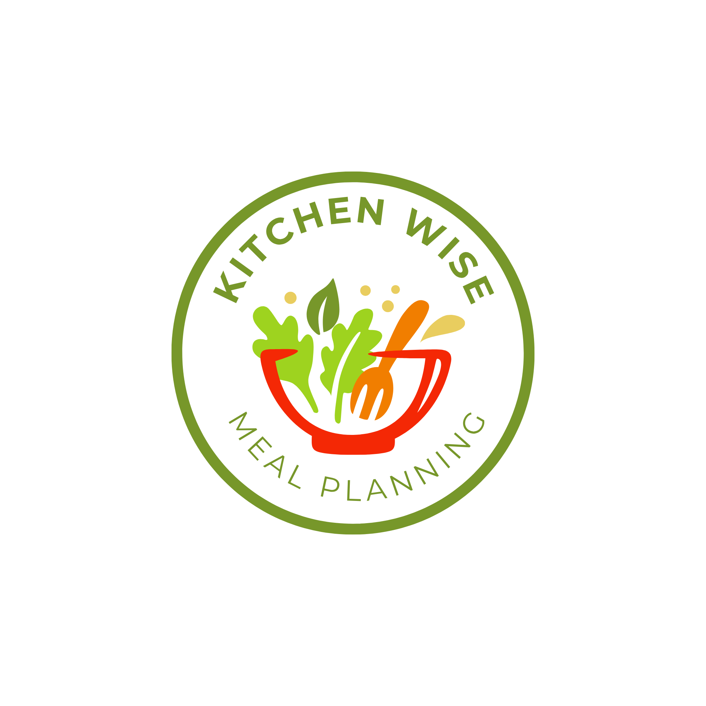

# Hi there 👋

My name is Adam. I'm a US Navy veteran turned software developer with a background spanning enterprise Java consulting, quality engineering, and modern full-stack development. I'm interested in Java, web development, and AI-assisted coding.

- 🔭 I'm currently working on two main projects: **repo-blueprint**, a VS Code extension for analyzing codebases, and **KitchenWise**, a full-stack meal planning app
- 🌱 I'm currently learning Security+, agentic AI, and Python
- 👯 I’m looking to collaborate on agentic AI microservices
- 🤔 I’m looking for help with agentic AI microservices
- 📫 How to reach me: email-ashaffe@gmail.com
- 😄 Pronouns: He/Him
- ⚡ Fun fact: I am a former certified yoga instructor

---
One flag: your VS Code extension's publish name on the Marketplace is controlled s

## 🧩 repo-blueprint

repo-blueprint is a VS Code extension that gives developers an instant, structured look at their codebase. Today, it reports total lines, lines of code, blank lines, function counts, and import counts right in a metrics panel, no context switching required, across JavaScript, TypeScript, Java, and Python. I'm actively extending it toward AI-assisted codebase analysis: using agents to help identify what needs updating, flag potential issues before they become bugs, and support debugging directly from the metrics it already surfaces.

**Tech stack:** `Java` `Springboot` `TypeScript` · `Webpack` · `VS Code Extension API`

**Explore the repo:**

- [`repo-blueprint`](https://github.com/GreatDeveloper66/repo-blueprint) — extension source, published to the VS Code Marketplace
- [`repo-blueprint-analysis-service`](https://github.com/GreatDeveloper66/repo-blueprint-analysis-service) — AI-assisted backend supporting repo-blueprint's codebase analysis

---

### 🍳 KitchenWise

KitchenWise is a modular, service-oriented application that takes the friction out of deciding what to eat. It generates personalized meal plans through the OpenAI API, tailors them to a user's dietary profile, and connects the resulting recipes to real grocery inventory nearby through the Google Places API. The goal isn't just another recipe generator. It's a system that understands what you can actually buy and cook this week.

**How it's built:**

- Five independent Node.js microservices: user authentication, dietary profile storage, AI meal plan generation, grocery store discovery, and meal plan storage
- Responsive TypeScript/React frontend
- JWT-based authentication across services
- MongoDB for persistence

**Tech stack:** `Node.js` · `TypeScript` · `React` · `MongoDB` · `OpenAI API` · `Google Places API` · `JWT`

**Explore the repos:**

- [`kitchenwise-meal-plan-service`](https://github.com/GreatDeveloper66/kitchenwise-meal-plan-service) — AI-driven meal plan generation
- [`user-auth-service`](https://github.com/GreatDeveloper66/user-auth-service) — authentication and authorization
- [`kitchenwise-diet-profile-service`](https://github.com/GreatDeveloper66/kitchenwise-diet-profile-service) — dietary profile storage
- [`kitchenwise-grocery-service`](https://github.com/GreatDeveloper66/kitchenwise-grocery-service) — grocery store discovery by location
- [`kitchenwise-recipe-service`](https://github.com/GreatDeveloper66/kitchenwise-recipe-service) — recipe generation and storage
- [`kitchenwise-plan-storage-service`](https://github.com/GreatDeveloper66/kitchenwise-plan-storage-service) — user meal plan storage

---

Most of my other repositories are private. These two projects represent my current, active work and are the best reflection of how I build software today.

- 🔭 I’m currently working on ...
- 🌱 I’m currently learning ...
- 👯 I’m looking to collaborate on ...
- 🤔 I’m looking for help with ...
- 💬 Ask me about ...
- 📫 How to reach me: ...
- 😄 Pronouns: ...
- ⚡ Fun fact: ...
-->
